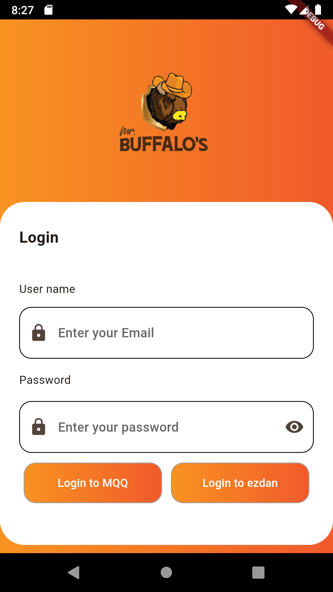
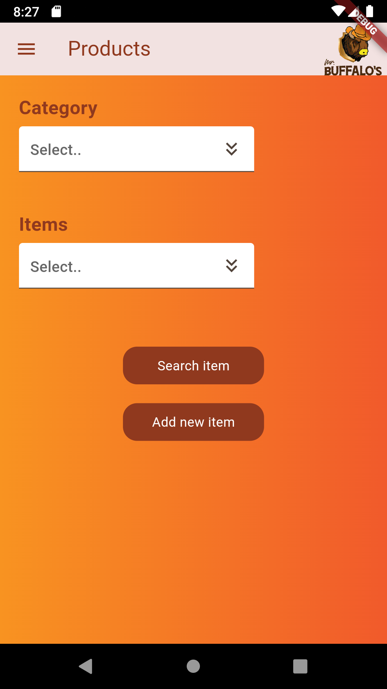

# Buffalos

This is Buffalos , It is an app to manage Restaurants , Stuff , safes and food items . The main goal of this project was to create a platform where Manager can easily Manage and Track the restaurant.

## Why this project ?

This project is a Flutter application. help user to Manage his restaurant , by Seeing all the Items and suppliers that he has in his Restaurant, Adding new ones, Editing

it give manager ability to track stuff performance , and see generate reports as pdfs

<table>
  <tr>
    <th>Screen</th>
    <th>Description</th>
    
  </tr>
  <tr>
    <td> </td>
    <td><strong>Login Screen</strong></td>
    
  </tr>
  <tr>
    <td> </td>
    <td>
    <li><strong>Product Screen</strong></li>
    <li>Search</li>
    <li>Add</li>
    </td>
    
  </tr>
  <tr>
    <td> </td>
    <td><strong>Login Screen</strong></td>
    
  </tr>
  <tr>
    <td> </td>
    <td><strong>Login Screen</strong></td>
    
  </tr>
  <tr>
    <td> </td>
    <td><strong>Login Screen</strong></td>
    
  </tr>
  <tr>
    <td> </td>
    <td><strong>Login Screen</strong></td>
    
  </tr>
  <tr>
    <td> </td>
    <td><strong>Login Screen</strong></td>
    
  </tr>
  <tr>
    <td> </td>
    <td><strong>Login Screen</strong></td>
    
  </tr>
  <tr>
    <td> </td>
    <td><strong>Login Screen</strong></td>
    
  </tr>
  <tr>
    <td> </td>
    <td><strong>Login Screen</strong></td>
    
  </tr>
  <tr>
    <td> </td>
    <td><strong>Login Screen</strong></td>
    
  </tr>
  <tr>
    <td> </td>
    <td><strong>Login Screen</strong></td>
    
  </tr>
  <tr>
    <td> </td>
    <td><strong>Login Screen</strong></td>
    
  </tr>
  <tr>
    <td> </td>
    <td><strong>Login Screen</strong></td>
    
  </tr>

</table>
